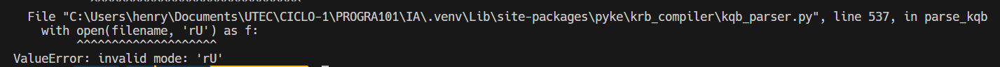
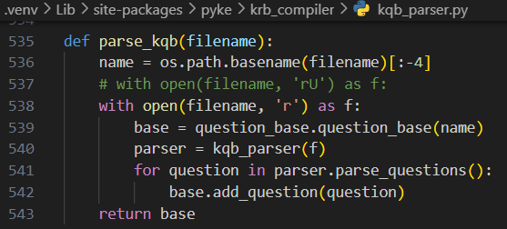

**SISTEMA EXPERTO - FORWARD CHAINING**
**(Detección de batería acústica o electrónica)**

- Crear y activar entorno virtual

```
~ python -m venv .venv
~ source ./.venv/activate
```

- Verificar la versión de python y las librerías instaladas por defecto

```
~ python --version (3.11.6)
~ pip freeze (vacío)
```

- Descargar y descomprimir librería pyke 1.1.1

```
~ !wget https://sourceforge.net/projects/pyke/files/pyke/1.1.1/pyke3-1.1.1.zip
!unzip pyke3-1.1.1.zip
```

- Instalar la librería en el entorno virtual

```
~ cd pyke-1.1.1/pyke
~ pip install .
```

- Verificar que la librería se haya instalado

```
~ pip freeze (debe aparecer la lib pyke 1.1.1)
```

#### Fix - Errores

- Si se tiene versiones de python >= 3.11.\* y aparece un error relacionado con el modo "U"



- Digirise a la librería de pyke ubicando esa línea para eliminar ese caracter "U"


